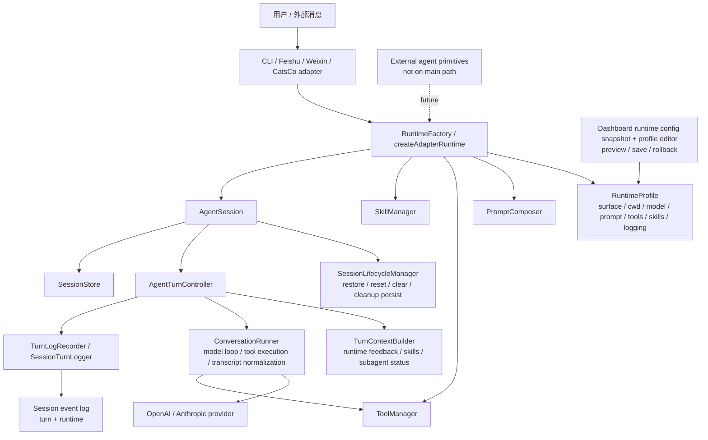

# XiaoBa Runtime 瘦身阶段报告

日期：2026-05-03

## 结论

本轮 runtime slimming 可以收口。它不是“整个项目所有后续工作都完成”，而是“runtime 内核、adapter 边界、日志链路、测试入口、lifecycle 隐式行为清理，以及第一版 Runtime Profile / Dashboard Config 已经达到可发布检查点”。

可以对外描述为：
- 核心 runtime 边界已明显收敛。
- CLI / Feishu / Weixin / CatsCo 已基本退回通讯适配层。
- `AgentSession` 已从大而杂的会话类收窄为公开入口、状态持有者和 turn/lifecycle 调度者。
- 后续 Dashboard 产品化、skill 管理、日志本地分析、external agent 正式接入应另开任务，不混入本轮收口。

不应该描述为：
- 整个项目已彻底重构完成。
- Dashboard 已经是完整产品级配置中心。
- external agent 已经进入生产主路径。
- prompt 已经是最终形态。

## 当前架构



核心原则已经变成：adapter 只管平台交互，runtime 默认值由 profile/factory/composer 管，session 只管会话边界和调度。

## 关键结果

| 领域 | 当前状态 |
| --- | --- |
| Runtime 配置 | `RuntimeProfile` 表达 surface、cwd、model、prompt、tools、skills、logging 等主要事实 |
| 服务创建 | CLI 使用 `RuntimeFactory.createSession()`；message adapters 使用 `createAdapterRuntime()` |
| Prompt | `PromptComposer` 统一拼装；默认身份不再硬编码为“小八”；工作目录与 tool cwd 对齐 |
| Tool | 默认工具名集中；`RuntimeProfile.tools.enabled` 是 factory 输入；不引入复杂 policy/pack |
| Adapter | Feishu / Weixin / CatsCo 不再自行 new runtime services，也不决定 prompt/tool 默认值 |
| AgentSession | turn pipeline、context 构建、日志转换、压缩、lifecycle 已拆出专门模块 |
| Lifecycle | restore/reset/clear/cleanup persist 归 `SessionLifecycleManager`；TTL map 管理仍归 `MessageSessionManager` |
| 隐式行为 | 已移除过期主动 wakeup 和 `/exit` 无产出 summary AI 调用 |
| 日志 | session event schema 支持 `turn` / `runtime`；日报和上传按日志内容解析 session id |
| Runtime feedback | 可恢复运行时错误以标准 SDK user message 形态进入当前 turn，不污染长期 history |
| Dashboard | 展示 runtime config snapshot，并通过受控 API 编辑安全 profile 字段；不直接写 `.env`，不保存 secret |
| External agent | 已有 registry / task packet / process runner / coding adapter primitives，未接主路径 |

## 已完成阶段

### Phase A - Runtime Foundation

完成内容：
- 修复 mixed session log 破坏日报解析。
- 修复上传链路从文件名推导 `session_id`。
- 定义 session event schema。
- 补 runtime characterization / regression tests。
- 引入最小 `RuntimeProfile` 和 `RuntimeFactory`。

### Phase B - Prompt Simplification

完成内容：
- 新增 `PromptComposer`，`PromptManager` 保留旧 API 并委托 composer。
- runtime info 从 profile 读取。
- 默认工作目录与 ToolManager cwd 对齐。
- 清理固定源码路径、硬性 IM 工具要求和“小八”身份硬编码。

### Phase C - Tool Boundary

完成内容：
- 默认工具名集中到 `DEFAULT_TOOL_NAMES`。
- `RuntimeFactory` 根据 profile 创建 `ToolManager`。
- profile tool validation 支持 unknown / duplicate fail-fast。
- 移除生产 `reply` 残留，保留 `send_text` / `send_file`。
- 避免引入过重 `ToolPolicy` / `ToolPack`。

### Phase D/E - AgentSession Slimming And Adapter Separation

完成内容：
- surface prompt 注入迁出 `AgentSession`。
- skill activation、slash command、transient skill list 迁到 `SessionSkillRuntime`。
- adapter runtime 创建统一经 factory/helper。
- message adapters 保留平台消息、附件、队列、身份映射、channel callback。

### Phase F - Dashboard Runtime Config

完成内容：
- 新增只读 runtime config snapshot API。
- Dashboard 可查看 profile、cwd、prompt 展开结果、工具、skills、日志路径、上传状态。
- 使用 readonly config，避免 GET 请求创建用户配置目录。
- URL 做 origin-only 脱敏。

当前边界：
- Dashboard 不是 runtime 配置真相源。

### Runtime Profile And Dashboard Config - Slice 1-4

完成内容：
- 定义 runtime profile file schema 和加载优先级：default profile -> environment/config -> runtime profile file -> surface override -> RuntimeFactory。
- 默认 profile 文件路径为 `~/.xiaoba/runtime-profile.json`，支持 `XIAOBA_RUNTIME_PROFILE_PATH` / `XIAOBA_PROFILE_PATH` override。
- CLI、adapter runtime、dashboard snapshot 都走同一套 profile resolution。
- Dashboard 配置页新增 Runtime Profile 编辑卡片。
- 支持编辑 `displayName`、`workingDirectory`、`tools.enabled`、`skills.enabled`。
- 支持 preview diff、validation、save、rollback。
- 保存前拒绝已有 profile 文件中的 secret、未知字段和 malformed editable values，避免 rollback sidecar 持久化不安全内容。

当前边界：
- Surface 仍由 adapter 决定，profile 文件不能改变当前 adapter 的 surface。
- Profile 编辑不直接写 `.env`。
- `model.apiKey` 等 secret 不进入 runtime profile 文件。
- 变更明确标记为“保存后新 session 生效”，不伪装成当前 session 热更新。

### Phase G - External Agent Orchestration

完成内容：
- 定义 `TaskPacket`、`ExternalAgentControl`、`ExternalAgentResult`、`ExternalAgentRegistry`。
- 新增独立 `ProcessRunner` 和 `CodingAgentAdapter`。
- 默认隔离 task directory：`.xiaoba/external-agents/<task-id>`。
- 补 disabled、non-zero exit、timeout、stdin/stdout 测试。

当前边界：
- 不接 `AgentSession`。
- 不接 `ToolManager`。
- 不接 CLI / Feishu / Weixin / CatsCo 主路径。

### Phase H - AgentSession Turn Pipeline

完成内容：
- 新增 `RuntimeFeedbackInbox` 管 runtime feedback queue/dedupe/reset。
- 新增 `TurnLogRecorder` 管 `RunResult -> session turn log`。
- 新增 `TurnContextBuilder` 管本轮 provider input 的临时上下文。
- 新增 `ContextWindowManager` 管 durable transcript 的 pre-turn compaction。
- 新增 `AgentTurnController` 管单轮消息处理 pipeline。

核心结果：
- `AgentSession` 不再直接拼 runtime feedback / skill list / subagent status。
- `AgentSession` 不再直接执行 token 判断和压缩。
- `AgentSession` 不再直接理解 turn log 的 tool call 映射细节。

### Phase I-A - Test And Doc Closure

完成内容：
- `npm test` 改为稳定 runtime suite。
- 新增 `test:runtime`、`test:legacy`、`test:all`、`test:list`。
- legacy 测试用显式 denylist 隔离旧 COO / Gauzmem / reminder 测试。
- 未来新增 `.test.ts` 默认进入 runtime suite。

### Phase I-B - AgentSession Lifecycle Slimming

完成内容：
- 新增 `SessionLifecycleManager`，接管 restore、pending restore、reset、clear、cleanup persist-and-clear。
- TTL session map / destroying guard 仍留在 `MessageSessionManager`。
- 移除过期主动 wakeup：TTL cleanup 只保存并清理，不再偷偷调用 AI 或主动发消息。
- 移除 `/exit` hidden summary：`/exit` 只清空当前内存 session，不再调用无产出的 AI summary。
- `MessageSessionManager` 不再持有 wakeup channelId / wakeup callback。

核心结果：
- lifecycle 保持简单、可预测。
- 过期 cleanup 不再有隐式模型调用和隐式平台发送。
- `/exit` 不再产生用户看不到、也不落盘的模型调用。

### Phase I-C - Closure And Release Prep

完成内容：
- 更新本阶段最终报告。
- 明确本轮 runtime slimming 可以收口。
- 明确 Dashboard/Profile 产品化另开新任务；第一版 profile schema、loader、preview/save/rollback 和 Dashboard 编辑 UI 已纳入本 checkpoint。
- 记录发布前检查项和当前剩余风险。
- 独立 review 指出的旧 `/exit` summary 注释已修正，TTL cleanup 同 key 新 session 竞态已补测试。

## 当前 Session 行为

斜杠命令：
- `/stop`：请求中断当前 turn。
- `/clear`：清空当前内存会话，保留持久化历史文件。
- `/clear --all`：清空当前会话，并删除持久化历史文件。
- `/skills`：列出当前 user-invocable skills。
- `/history`：显示当前 messages 数量和 ContextWindowManager 管理状态。
- `/exit`：清空当前内存 session 并返回告别，不调用 AI。
- `/<skillName> [args...]`：激活可由用户调用的 skill；有参数时把参数继续作为用户消息执行。

Session 独立性：
- 飞书私聊、飞书群聊、Weixin、CatsCo 仍按各自 session key 独立。
- 同平台不同 chat/user/group 不共享 `AgentSession`。
- adapter 可以在创建 session 时注入 context，但最终恢复顺序保持 system -> persisted history -> injected context。

## 测试状态

最后一次完整验证：

```bash
npm run build
npm test
```

结果：
- TypeScript build passed。
- `npm test`：37 个 runtime test files；53 top-level TAP tests / 48 suites / 192 tests 全部通过。

关键覆盖：
- runtime profile / factory
- prompt composer / prompt copy regression
- tool manager
- adapter runtime
- session log schema / daily report / log uploader
- runtime feedback provider boundary
- conversation runner transcript normalization
- context compressor / context window manager
- dashboard runtime config snapshot
- dashboard runtime profile API / profile editor
- external agent orchestration primitives
- agent session lifecycle / message session manager TTL cleanup

## 发布前检查清单

建议合并前确认：
- `npm run build` 通过。
- `npm test` 通过。
- 本地 smoke：`npm run start -- catscompany` 可以正常连接并对话。
- 本地 smoke：`npm run start -- dashboard` 可以打开配置页。
- 工作区里和本轮无关的临时文件不要混进提交，例如截图、临时 HTML、scrna 输出、`.bak` 文件、实验脚本。
- `docs/runtime-slimming-log.md` 和本报告保持一致。
- 如果要发 PR，建议说明本轮是 runtime foundation + profile/dashboard config checkpoint，不包含 Dashboard 产品化、skill 管理、日志分析和 external agent 生产接入。

当前工作区注意事项：
- 存在大量 untracked 文件和历史临时资源，需要在提交前人工挑选。
- 当前未发现 `.bak` 文件。
- `dashboard/pet/` 是后续 Dashboard UI 资源候选；是否放入本次 checkpoint 需要单独确认。
- 顶层历史文档、AI eval 结果、`skills/officecli`、`skills/sc-analysis` 是否进入本次 checkpoint 需要单独确认。

## 下一任务建议

下一任务建议单独开：`Runtime Productization And Dashboard Operations`。

推荐目标：
- 先做发布检查点和 diff 清理。
- CatsCo 命名正式化：用户可见文案改 CatsCo，`catscompany` 命令保持兼容。
- Dashboard/Profile 产品化：更清晰的状态、错误提示、保存影响范围，不把 dashboard 变成隐式配置源。
- Skill Management：展示、启用、禁用、重载和错误反馈。
- Unified Logs And Local Analysis：本地日志视图、错误定位、上传状态。
- Subagent Management：状态、取消、结果验收、transient context 边界。

暂不建议马上做：
- external agent 接入主路径。
- Dashboard 直接编辑 system prompt 大文本并立即生效。
- 复杂 tool policy / permission engine。
- 大范围目录重组。
